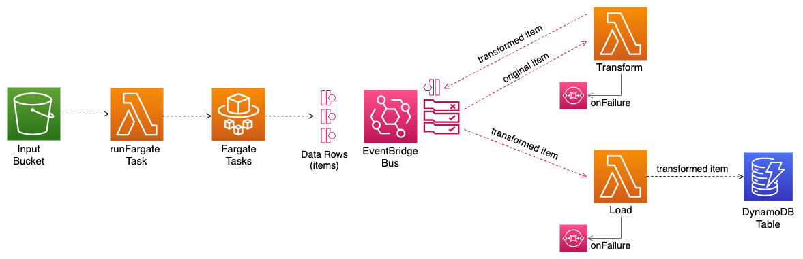

# Go-Serverless-ETL

This is an example of a Go application based on the CDK pattern [The EventBridge ETL](https://github.com/cdk-patterns/serverless/tree/main/the-eventbridge-etl), but with a few changes in the architecture and written in Go.

When a user uploads a spreadsheet with real state transactions [SacramentoRealeStateTransactions.csv](assets/test_files/SacramentoRealeStateTransactions.csv), the application will parse and add some information to each transaction and store them in a DynamoDB table. 

Though in this case the application is processing and transforming data specific to real state transactions, you could use this pattern for similar applications, where you need to process CSV files and store the data in DynamoDB. 

### Architecture

Every time a file is added to the `upload` folder in the S3 bucket, the `runFargateTask` Lambda gets triggered and starts the Fargate task. The task reads each row in the spreadsheet and sends them to the EventBridge bus eventually. 
The `Transform` Lambda then receives each transaction from the bus, parses some values and adds additional information. The transformed item is later sent to the bus and the `Load` Lambda will store it in the DynamoDB table.   



#### Scaling

The Go container creates a predefined number of goroutines listening on a channel (worker pool). The rows of the spreadsheet are sent to this channel and the different goroutines will send them to the EventBridge bus. This is a way to control the number of request we sent per second to the bus. `PutEvents` has a soft limit of 10,000 requests per second in us-east. See [EventBride quotas per regions](https://docs.aws.amazon.com/eventbridge/latest/userguide/eb-quota.html#eb-putevents-limits)

The `runFargateTask` Lambda has a reserved concurrency to guarantee it will always be able to start the Fargate Task. 

EventBridge invokes Lambda functions asynchronous. If you reach the Lambda concurrency limit in the account and throttling starts to occurs, AWS will try to run the Lambdas for up to 6 hours. If the Lambda function fails with an error, then the item is sent the Queue destination. 

### Repo Structure

    .
    ├── cdk_infra                    # Cloud application resources (IaC)
    |
    ├── container                    # Go container
    |
    ├── lambdas                      # Lambda application code                     
    |   |
    |   |── Load                     # Stores transformed item in DynamoDB 
    |   ├── Transform                # Parses data and add price per square foot
    |   ├── RunFargateTask           # Runs Fargate task after S3 event                          
    |
    └── ...

### How to deploy

1. `npm install`
2. `npm run cdk deploy TableStack S3LambdaFargateStack EventBridgeLambdasStack`

Please notice that if you are using a computer with an ARM-based processor like the Apple M1, the Fargate container will fail in the cloud.

To solve this issue you need to deploy the stacks using CodePipeline. Please fork this repository, then open to the following file `cdk_infra/pipeline-stack.ts` and enter your Github user.

```typescript
new CodePipelineStack(app, 'DeploymentPipelineStack', {
  repoOwner: <github_user>,
  repoName: 'go-serverless-etl'
})
```

You will also need to create a secret with the Github token so CodePipeline can create the Github webhook. Please name the secret `GithubCodePipelineToken` and assign the value to a `token` key.
The Github PAT needs to have the following permissions:

```
repo - to read the repository
admin:repo_hook - if you plan to use webhooks (true by default)
```

Then you can deploy the CodePipeline stack:
`npm run cdk deploy DeploymentPipelineStack`


### Useful commands

 * `npm run cdk deploy`      deploy this stack to your default AWS account/region
 * `npm run cdk diff`        compare deployed stack with current state
 * `npm run cdk synth`       emits the synthesized CloudFormation template
